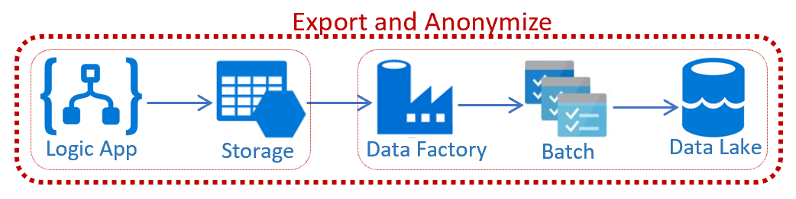

# Chapter 3.2 - Export and Anonymize: Export and Anonymize FHIR data to Azure Data Lake

#### This chapter refers to [FHIRExportwithAnonymization](https://github.com/microsoft/health-architectures/tree/master/FHIR/FHIRExportwithAnonymization) focusing on exporting data out of Azure API for FHIR.

The FHIR Export with Anonymization is a template for bulk exporting data from Azure API for FHIR, deidentifying the data and storing in Azure Data Lake.

The template has two main components:
* Bulk Export: Logic app bulk exports FHIR data into Blob Storage
* Anonymization: Logic app runs Data Factory pipeline which calls Azure Batch for deidentifying the data and stores in Azure Data Lake

## Architecture

## Setup
* Go to [FHIRExportwithAnonymization](https://github.com/microsoft/health-architectures/tree/master/FHIR/FHIRExportwithAnonymization) to implement the template.

*** 

