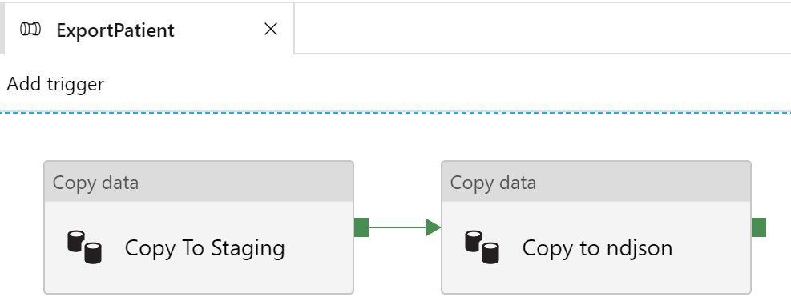
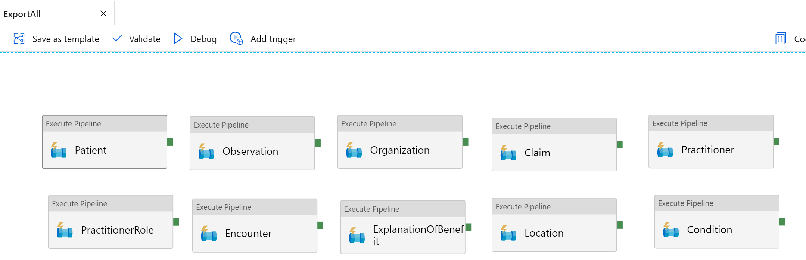

# Chapter 4 - Azure Data Factory: Convert bundles to delimited json (ndjson)

Azure Data Factory is a cloud data integration service that orchestrates and automates movement and transformation of data.

This Data Factory is used to export resource types to [ndjson](http://ndjson.org/) files. Download the [template](./azuredeploy-adf.json) and deploy an Azure Data Factory instance using custom template deployment. The template has an array parameter called `resourceTypes`, which can be set to the resource types for which the export pipelines should be deployed.

The template will create:
* Blob Storage account with `datastaging` and `dataexport` containers.
* Linked Services to Blob Storage account, REST (Azure API for FHIR) and Databricks.

* Datasets for each resource type for `datastaging`, `dataexport` containers and REST (Azure API for FHIR)
* A pipeline for each of the resource types specified. The following screenshot shows an example of the Patient pipeline.

* Create a master pipeline to combine all the pipelines by adding Execute Pipelines. This shows and example of 10 resource types.

Publish All and run the master pipeline to export ndjson files for all specified resource types to blob storage `dataexport`. 

***

[Go to Chapter 5 - Azure Databricks: Parse json and load into Azure SQL DB](../Chapter5-AzureDatabricks/ReadMe.md)
