# Chapter 6 - Power BI: Analyze the FHIR bundles

#### This chapter shows 3 options to connect and analyze health records with PowerBI.

## Prerequisites
* [PowerBI Desktop](https://powerbi.microsoft.com/en-us/downloads/)
* Knowledge of [PowerBI](https://docs.microsoft.com/en-us/power-bi/guided-learning/)
* Knowledge of [PowerQuery](https://docs.microsoft.com/en-us/power-query/) & [M formula language](https://docs.microsoft.com/en-us/powerquery-m/)

Power BI is a business analytics service provided by Microsoft. Power BI lets you easily connect to your data sources, visualize and discover what’s important, and share with anyone you want.

## Option 1: Connect to SQL DB
This option shows how 10 resource types of FHIR data - parsed using Azure Databricks and stored in SQL DB based on previous chapters - can be analyzed in Power BI.

* Open PowerBI Desktop
* Connect to the SQL DB from PowerBI desktop and use this sample query. This query uses 10 resource types and you can update as needed.

```
SELECT * 
FROM Organization O 
JOIN Location L ON O.organizationid = L.organizationid
JOIN (
	SELECT 
		P.practitionerid
		,P.practitionercode
		,street
		,city
		,postalcode
		,state
		,country
		,gender
		,firstname
		,lastname
		,contact
		,PR.practitionerroleid
		,PR.locationid
		,PR.organizationid
		,PR.practitionername
	FROM Practitioner P
	JOIN PractitionerRole PR ON P.practitionerid = PR.practitionerid) P ON O.organizationid = P.organizationid AND L.locationid = P.locationid
LEFT OUTER JOIN Claim C ON L.locationid = C.locationid AND O.organizationid = C.organizationid 
LEFT OUTER JOIN Encounter E ON C.encounterid = E.encounterid 
LEFT OUTER JOIN Observation OB ON E.encounterid = OB.encounterid  
LEFT OUTER JOIN ExplanationOfBenefit EOB ON C.encounterid = EOB.encounterid AND C.claimid = EOB.claimid
LEFT OUTER JOIN Patient PT ON PT.patientid = EOB.patientid
```
* Analyze and visualize using Power BI


## Option 2: Connect to Azure API for FHIR
This option shows how to connect and analyze FHIR data stored in Azure API for FHIR from Power BI desktop.

* Open Power BI Desktop
* Go to Menu --> Edit Queries --> Edit Queries --> Advanced Editor and paste the following:

```
let

 url = "https://login.microsoftonline.com/<tenantid>/oauth2/token",

 GetJson = Web.Contents(url,
     [
         Headers = [#"Content-Type"="application/x-www-form-urlencoded;charset=UTF-8"],
         Content = Text.ToBinary("grant_type=client_credentials&client_id=<clientid>&client_secret=<clientsecret>&resource=<audience>") 
     ]
 ),
 FormatAsJson = Json.Document(GetJson),

 AccessToken = FormatAsJson[access_token],
 AccessTokenHeader = "bearer " & AccessToken,

GetJsonQuery = Web.Contents("<audience>/Patient",
     [
         Headers = [#"Authorization"=AccessTokenHeader]
     ]
 ),
 FormatAsJsonQuery = Json.Document(GetJsonQuery),
 MyJSONTable = Table.FromRecords({FormatAsJsonQuery})
in
    MyJSONTable
```

* Use Power Query to parse the json and prepare the data
* Analyze and visualize using Power BI


## Option 3: Connect to Azure Data Lake storing FHIR JSON Bundles
This option shows how to connect and analyze FHIR data stored in Azure Data Lake from Power BI desktop.

## Prerequisites
* An [Azure Data Lake Storage (Gen2)](https://docs.microsoft.com/en-us/azure/storage/blobs/data-lake-storage-quickstart-create-account/) with FHIR JSON Bundles within a container
* Knowledge of [Storage Explorer](https://docs.microsoft.com/en-us/azure/storage/blobs/data-lake-storage-explorer/)
* Knowledge of [PowerQuery](https://docs.microsoft.com/en-us/power-query/)

NOTE:  I've included the resulting [FHIR Financial Example](./FHIRFinancialExample.pbix) pbix file from the steps below so you can start with a working example.  Make sure you change the path to your data lake and ensure you've properly setup the permissions for your account using that link.  Also make sure you've placed some json bundles there as well.

### Getting Started

* 1 - Copy JSON Bundles generated by Synthea into a folder within your Azure Data Lake Storage Gen2 (I recommend starting with 4 or 5 total). If you'd like to use the ones I used you can find them [FHIR Bundles](./FHIR-Bundles/)

* 2 - Open PowerBI Desktop

* 3 - Connect to the Azure Data Lake Storage Gen2 Account from PowerBI desktop using the Azure Data Lake Storage (Gen2) Connector via the GetData Option.

<center>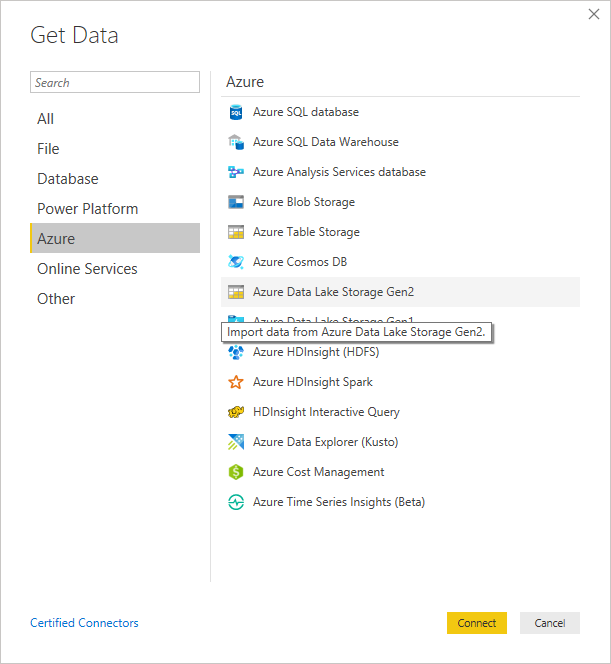</center>

Note:  Make sure you specify the full path to the container and/or folder in the container (for example: \<adfsgen2 url\>/\<container\>/\<folder/subfolder\>), and add "Storage Blob Data Reader" role in Azure Data Lake Storage Gen2 for the user accessing this, otherwise you get a cryptic error: 

<center>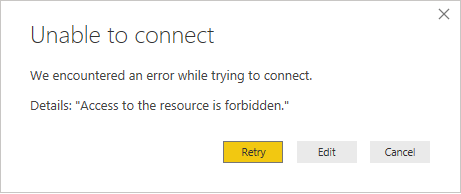</center>

I created a powerbi/fhirlimited folder in Azure Data Lake Storage Gen2 and placed the json files there.  My path looks like this https://***.dfs.core.windows.net/powerbi/fhirlimited

When you get it right you'll be presented with an option to combine and transform the source json data for query.

<center>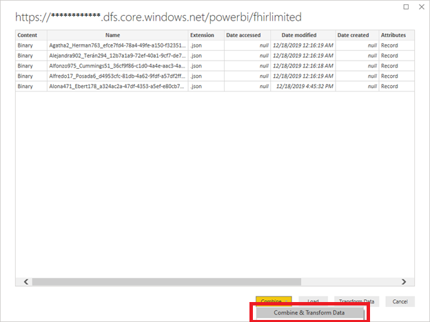</center>

* 4 - Start working with the bundles. 

Note:  Your source names might be different if you are not using your own data. 

You should end up in PowerBI Query Editor with the results of your query

<center>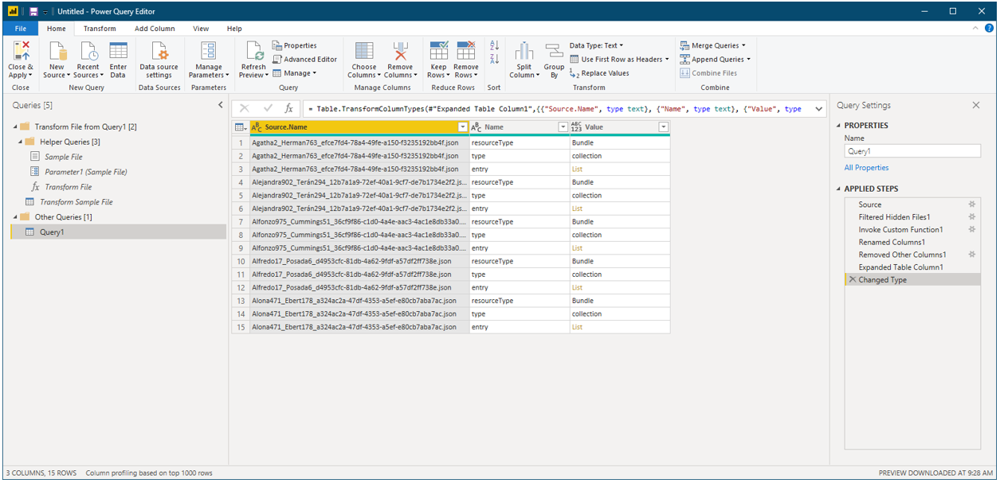</center>


* 5 - Reference the original query and name it Bundles. 

<center>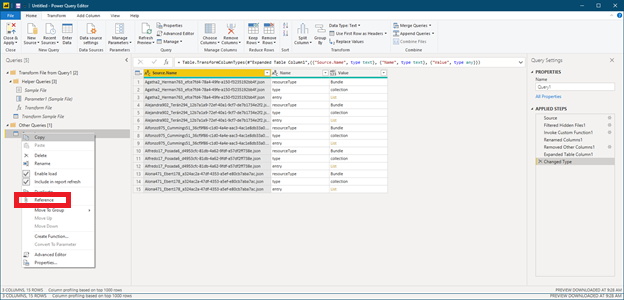</center>

* 6 - Filter out Bundle and Collection values because we are looking for the data within the entry nodes of the json (click the dropdown next to the column Value and unselect Bundle and Collection)

* 7 - Expand the remaining (entry) list into new records to reveal the fullUrl and the resource itself

<center>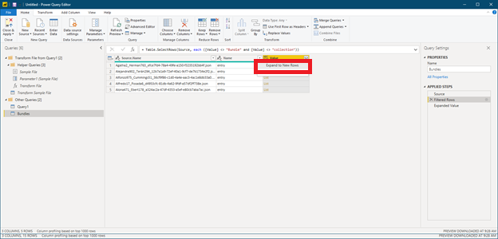</center>
<center>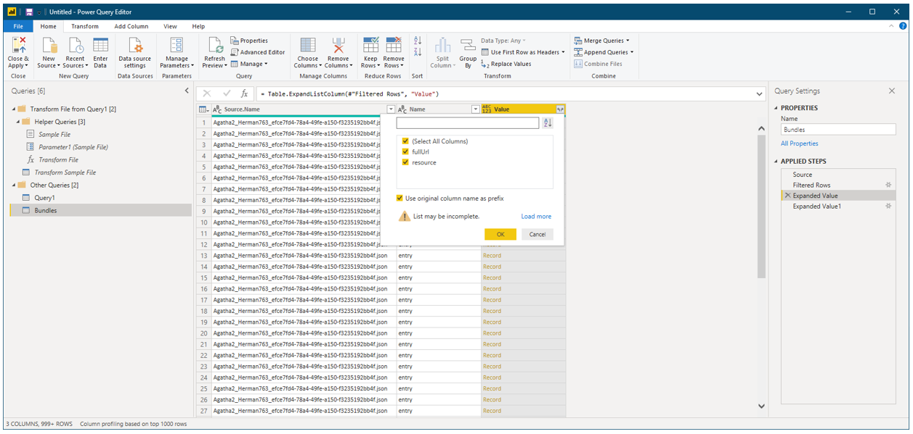</center>


* 8 - Duplicate the Value.resource column so we get access to the resourceType by expanding the duplicate revealing only the resourceType value

<center>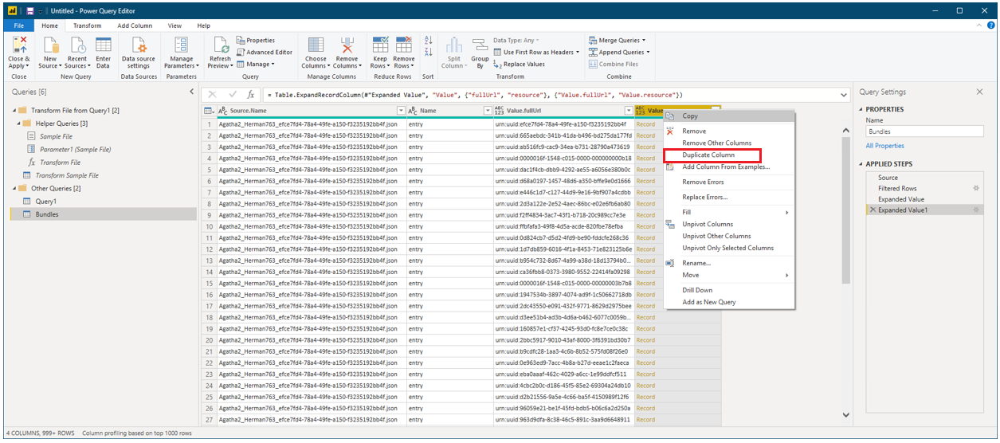</center>
<center>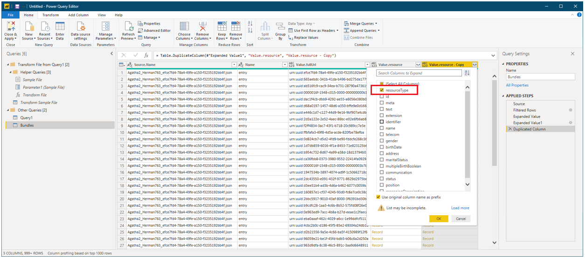</center>
<center>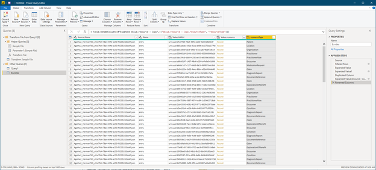</center>

* 9 - Reference our Bundles Query and name the reference Patients that only shows Patient resources by filtering for Patient.  Expand 'record' and 'list' for each patient and including all values that can futher be expanded (I've expanded resource.name to reveal use, family, etc..)

<center>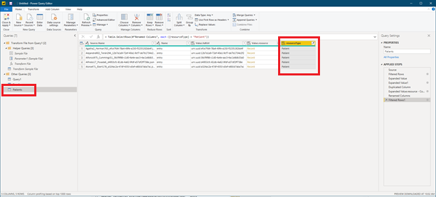</center>
<center>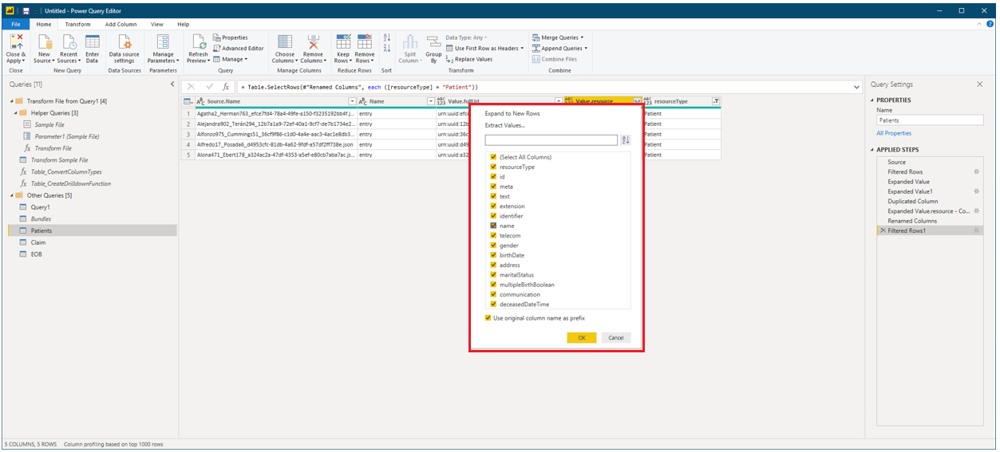</center>
<center></center>

Repeatedly expanding further areas of the model allows for us to investigate FHIR resources and the types used with types (in this case a Patient Type and the Name type)

* 10 - Perform the same steps for the Claim Resource type and the Explanation of Benefits type and expand their resource.patient values, so that we can expose those values and build many-to-many relationships between Patient, Claim, and EOB within our model

<center>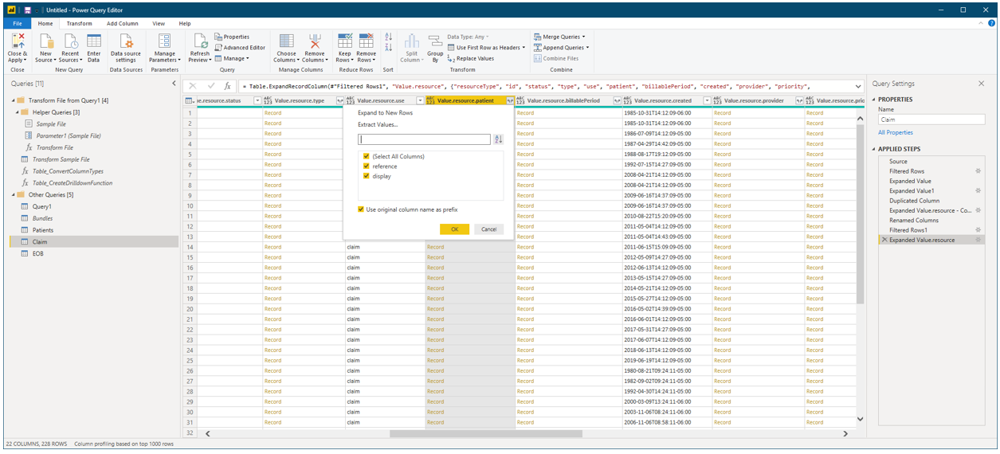</center>
<center>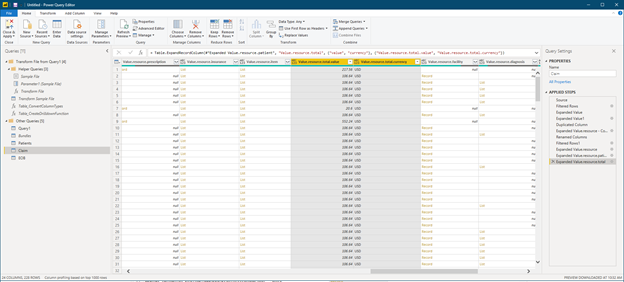</center>

*Once you get a few types expanded and the references setup properly you'll end up with a model that you can navigate with the goal of exploring and building quick reports and dashboards to further explore

<center>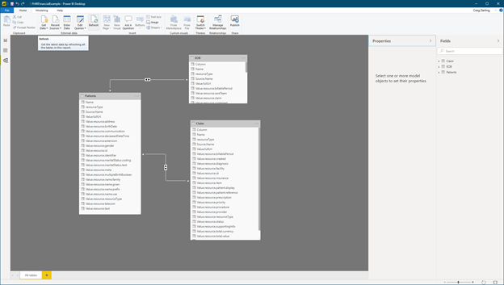</center>
<center>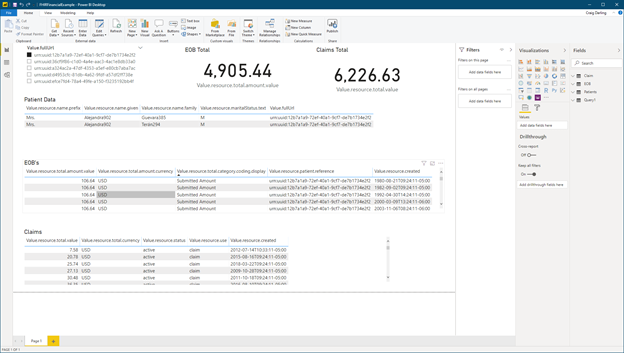</center>


***

[Go to Chapter 7 - Open Source FHIR Server: Create and Configure](../Chapter7-OpenSourceFHIRServer/ReadMe.md)

