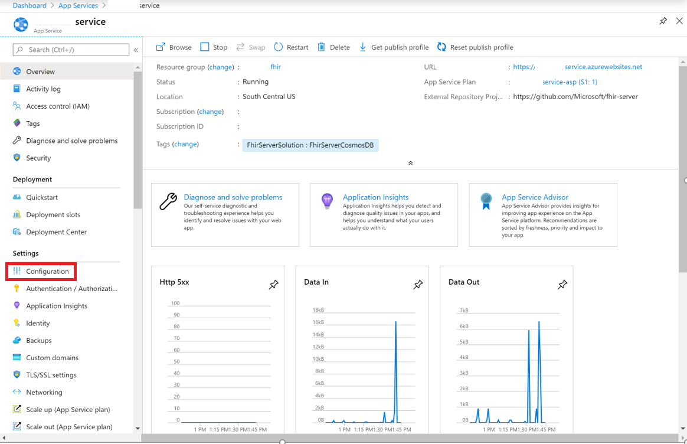
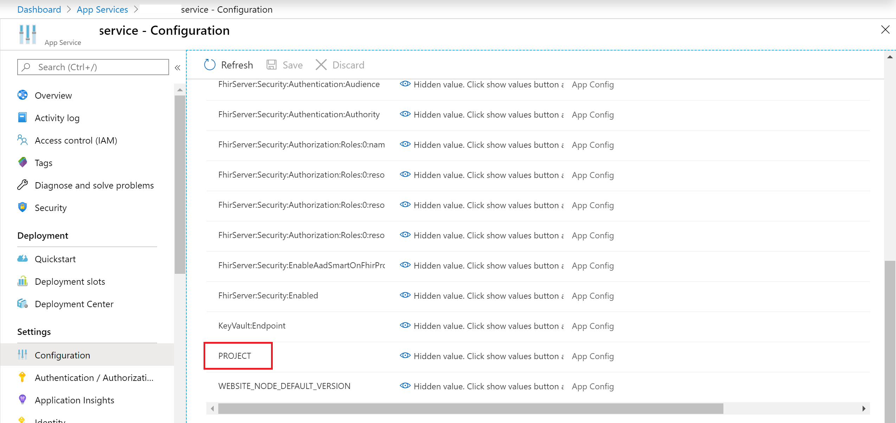
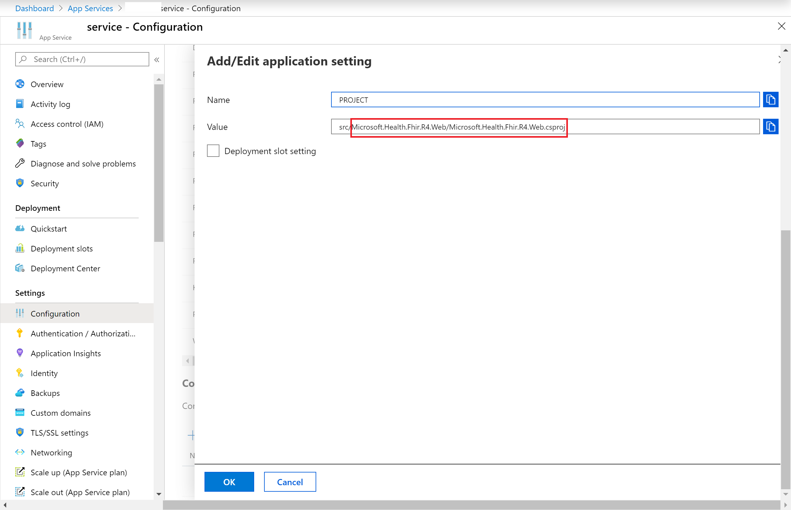
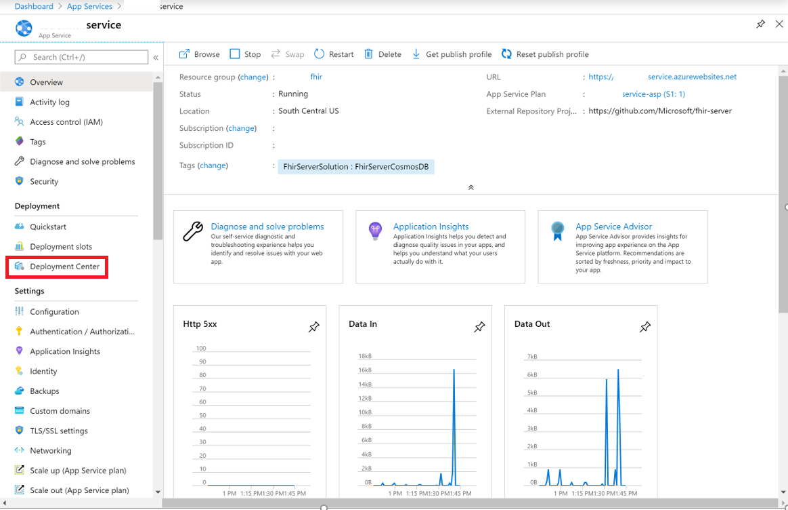
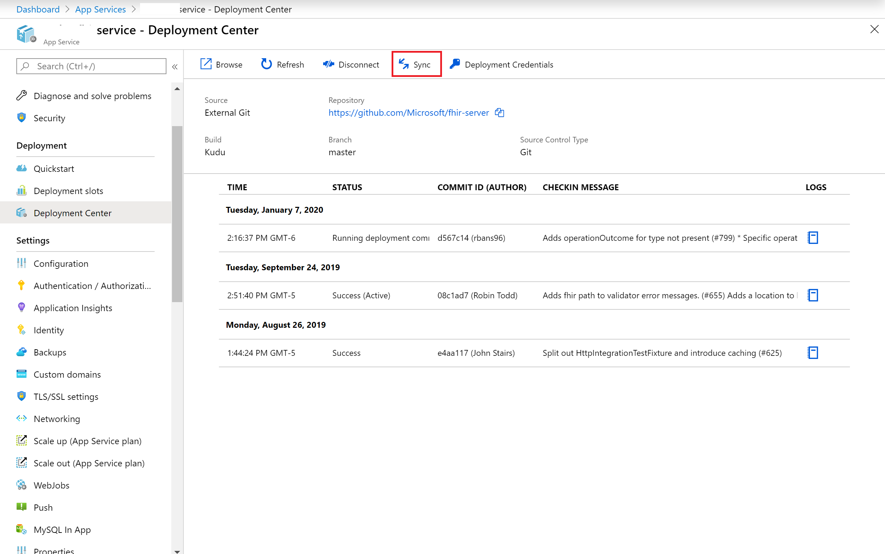

# Chapter 7 - Open Source FHIR Server: Create, Configure, Build, Change FHIR Version as needed

#### This chapter shows how to setup and use Open Source FHIR Server.

[FHIR](https://hl7.org/fhir/) standard is a new schema for US Healthcare that enables universal interoperability of EHR. FHIR ensures that data is stored in a consistent format and uses unique identifiers to connect it to related patient data so it is organized into structured data points.

FHIR Server for Azure is an open-source implementation of the emerging [HL7 Fast Healthcare Interoperability Resources (FHIR) specification](https://www.hl7.org/fhir/) designed for the Microsoft cloud. 

This is built on [samples](https://github.com/Microsoft/fhir-server).

## Prerequisites
* Access to create Azure Virtual Machines
* Access to register apps in Azure Active Directory
* Postman 

## Setup
* [Setup Open Source FHIR Server](https://docs.microsoft.com/en-us/azure/healthcare-apis/fhir-oss-portal-quickstart) to deploy the Open Source FHIR server using an Azure resource template.
* [Verify access to Open Source FHIR Server with Postman](https://docs.microsoft.com/en-us/azure/healthcare-apis/access-fhir-postman-tutorial). Postman helps interact directly with the FHIR server as you build applications for debugging purposes.
* [Register Applications](https://docs.microsoft.com/en-us/azure/healthcare-apis/tutorial-1-decision-flow) shows the decision flow for Azure Open Source FHIR Server.
* Register Client Application: A client application registration is an Azure Active Directory representation of an application that can be used to authenticate on behalf of a user and request access to resource applications. A confidential client application is an application that can be trusted to hold a secret and present that secret when requesting access tokens.
  Register a [Confidential](https://docs.microsoft.com/en-us/azure/healthcare-apis/register-confidential-azure-ad-client-app) AND/OR [Public](https://docs.microsoft.com/en-us/azure/healthcare-apis/register-public-azure-ad-client-app) Application.
* Object IDs: The fully managed Azure API for FHIR service is configured to allow access for only a pre-defined list of identity object IDs. An identity object ID is either the object ID of a user or a service principal in Azure Active Directory. The Object ID of the user that provisioned the service is added by default. Add the [object ID](https://docs.microsoft.com/en-us/azure/healthcare-apis/find-identity-object-ids) for the client application to the FHIR service.
* Configure [Cosmos Database Settings](https://docs.microsoft.com/en-us/azure/healthcare-apis/configure-database). FHIR Server uses Cosmos DB (or SQL Server) to store its data. Performance of the underlying CosmosDB database depends on the number of Request Units (RU) selected during service provisioning or in database settings after the service has been provisioned. Default is 400 RUs. This can be increased in Azure API for FHIR configuration. 
* [Enable Diagnostics Logging](https://docs.microsoft.com/en-us/azure/healthcare-apis/enable-diagnostic-logging) helps to monitor the service and provides compliance reports.

***

Set yourself up for moving between versions of FHIR (most notably STU3 to R4)

* Once you've deployed the open FHIR server and have it running as an app service, you can change the project reference the application uses to perform the build.  By doing this you can point the the version of FHIR you'd like to run.

Access the Azure portal and navigate to your App Service hosting your FHIR Server.  You'll notice that the template configures your external repository appropriately for the open source FHIR server location.  Select Configuration to access the application settings used for your app service.

Scroll down and click on the Project 

Change the version to your desired version to run (HINT:  You can look at the [FHIR Server source](https://github.com/microsoft/fhir-server/tree/master/src) to see what project versions are out there to point to, which are located in the *.Web folders)  As of this time we have [Microsoft.Health.Fhir.Stu3.Web](https://github.com/microsoft/fhir-server/tree/master/src/Microsoft.Health.Fhir.Stu3.Web) and [Microsoft.Health.Fhir.R4.Web](https://github.com/microsoft/fhir-server/tree/master/src/Microsoft.Health.Fhir.R4.Web).

Update it accordingly and then select the Deployment Center and press sync.  They will fetch from source control and perform a deployment/build.  Depending on your app service plan this could take a little while.  Press Refresh to see the status update as it performs the deployment

*** 

