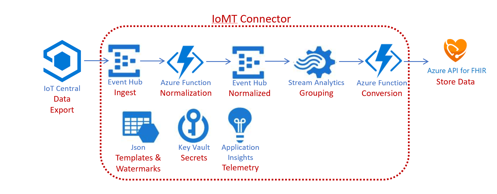

# Chapter 8 - IoMT FHIR Connector for Azure

#### This chapter is summarized version of [IoMT FHIR Connector for Azure GitHub](https://github.com/microsoft/iomt-fhir). Click on the link for more details.

The IoMT FHIR Connector for Azure is an open-source project for ingesting data from IoMT (internet of medical things) devices and persisting the data in a FHIR® server. This enables developers to rapidly deploy a service for ingesting high frequency IoMT data and landing the data in a FHIR server of their choice.

In this chapter, device data is written to FHIR® server using Azure IoT solutions (IoT Central). The connector does not provide device security or management which are covered by the Azure IoT solutions mentioned.

Privacy and security are top priorities and the IoMT FHIR Connector for Azure has been developed in support of requirements for Protected Health Information (PHI). All the Azure services used in IoMT FHIR Connector for Azure meet the compliance requirements for Protected Health Information.

## Architecture

* **Ingest**: Device data from IoT Central is ingested into an Event Hub `devicedata`. Event Hub throughput units can be scaled based on the message volume.
* **Normalization**: Device data in Event Hub `devicedata` is processed and compared using [device content](../deploy/devicecontent.json) configuration file using Azure Function `NormalizeDeviceData`. Types, values, and other important information are extracted into a common format for further processing.
* **Normalized**: The normalized output from the Azure Function `NormalizeDeviceData` is written to a Event Hub `normalizeddata`.
* **Grouping**: The normalized data in Event Hub `normalizeddata` is grouped in Stream Analytics according to device identity, measurement type, and the configured time period. The time period controls the latency of when observations are written to FHIR.
* **Conversion**: Output from Stream Analytics grouping and buffering stage is processed using Azure Function `MeasurementCollectionToFhir`. Observations are generated by matching the types from the normalized data to the templates defined in the [FHIR mapping](../deploy/fhirmapping.json) configuration file. The Observations are created or merged (configurable in Function App) with the device and patient in the configured destination FHIR server.

## Steps
* Create and configure the prerequisite **[Azure API for FHIR R4 server](../Chapter2-AzureAPIforFHIR/ReadMe.md)** with support for Device, Patient, and Observation resources.
More details on [Azure API for FHIR](https://docs.microsoft.com/en-us/azure/healthcare-apis/).

* Deploy **[IoMT FHIR Connector for Azure using ARM Template](https://github.com/microsoft/iomt-fhir/blob/master/docs/ARMInstallation.md)**\
This ARM Template is for easy provisioning of an environment within Azure. 
Note: Resource Location is required. Choose the right [Resource Identity Service Type](https://github.com/microsoft/iomt-fhir/blob/master/docs/ARMInstallation.md#resource-identity-service-type) based on if patient and device data already exists in your FHIR server. When executed, the ARM template will provision the following:\
-- App Service Plan - The service plan used for hosting the Azure Functions Web app.\
-- Azure Web App - The web app running the Azure Functions responsible for normalization and FHIR conversion.\
-- Azure Event Hubs - Two Event Hubs are deployed. `devicedata` is the initial ingestion point for device data. `normalizeddata` receives normalized device data for further processing.\
-- Azure Stream Analytics - Used to group and buffer the normalized data stream. Controls the end to end latency between device data ingested and landing the data in the configured FHIR server.\
-- Azure Key Vault - Used for secret storage. Event Hub Shared Access Keys and the OAuth client credentials are stored here.\
-- Azure Storage - Used by the Azure Functions to track Event Hub processing watermark and also hosts the configuration files for device normalization mapping and FHIR conversion mapping.\
-- App Insights - Used to record telemetry.

* **Configure templates**\
The IoMT FHIR Connector for Azure requires two JSON configuration files. Use Azure Portal or Azure Storage Explorer to upload these two configuration files to the storage container "template" created under the blob storage account provisioned during the ARM template deployment. Configuration files are loaded from blob per compute execution. Once updated they should take effect immediately.\
-- [device content](../deploy/devicecontent.json) which is responsible for mapping the payloads sent to the Event Hub end point and extracting types, device identifiers, measurement date time, and the measurement value(s). Used for normalization by Azure Function `NormalizeDeviceData`.\
-- [FHIR mapping](../deploy/fhirmapping.json) which allows configuration of the length of the observation period, FHIR data type used to store the values, and code(s). Used for FHIR conversion by Azure Function `MeasurementCollectionToFhir`.

* **Setup app in IoT Central**\
Use the [continuous data export](https://docs.microsoft.com/en-us/azure/iot-central/core/howto-export-data-pnp) feature in IoT Central to export data to Event Hub.  The target endpoint will be the `devicedata` Event Hub.  When selecting the types of data to export only *Telemetry* is needed.  Device and templates can be left unchecked. 

* **Verify**\
After a few minutes, use Postman or other tool to check the FHIR server for observations from simulated devices. Ex: GET request with FHIR Server URL: https://<fhirserver>.azurehealthcareapis.com/Observation, client id and client secret.

* **Monitor**\
-- Check Application Insights metrics for errors and telemetry for logical components of the connector, Event Hubs for number of messages received and sent and Stream Analytics for the watermark delay along with input and output events.\
-- If messages are in `devicedata` but not in `normalizeddata`, then `devicecontent.json` templete is not in the Blob Storage or isn't matching the payload sent from the device.\
-- If FHIR conversion is not called, Stream Analytics has a buffering code for 5 minutes in the last line of the query. Give it time and check again.\
-- If FHIR conversion is called but don't see observations in FHIR server, check the configuration `ResourceIdentity:ResourceIdentityServiceType` in Function App. Default is `R4DeviceAndPatientLookupIdentityService` in ARM Template. Check if a device resource is properly created and is linked to a patient resource in the FHIR server. The device id extracted by the template should match the device identifier on device resource in FHIR. Change to `R4DeviceAndPatientCreateIdentityService` to create a shell patient and device resources will be created.
More on [Resource Identity Service Type](https://github.com/microsoft/iomt-fhir/blob/master/docs/ARMInstallation.md#resource-identity-service-type).\
Some of the above are handled and might not show as error in metrics. More on [debugging](https://github.com/microsoft/iomt-fhir/blob/master/docs/Debugging.md#debugging).

*** 

