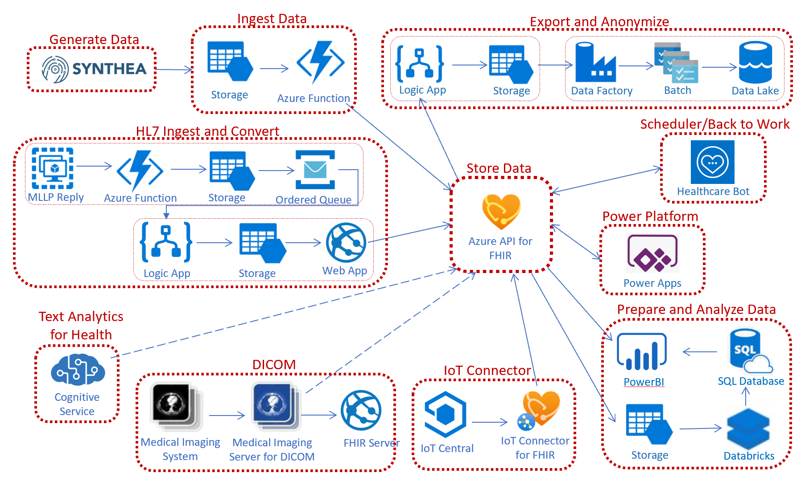

# OnFHIR - Starter Kit for Azure API for FHIR 

This respository contains example code and scenarios that shows the use of the [Azure API for FHIR](https://docs.microsoft.com/azure/healthcare-apis) PaaS server to populate and consume patient and financial data. 
Some sample codes are used from the [FHIR Server Samples] (https://github.com/microsoft/fhir-server-samples).

The overall solution architecture is a combination of: Generate sample FHIR data using Synthea, Load that data into Azure API for FHIR, Store that data, and Consume that data using Azure services.

# Contents

* [Chapter 1 - Synthea: Generate FHIR patient and financial bundles](./Chapter1/Synthea.md)
* [Chapter 2 - Azure API for FHIR: Create and configure](../Chapter2/AzureAPI.md)
* [Chapter 3 - Azure Blob storage: Load the bundles](../Chapter3/AzureBlob.md)
* [Chapter 4 - Azure Function: Bulk ingest into Azure API for FHIR](../Chapter4/AzureFunction.md)
* [Chapter 5 - Azure Data Factory: Convert bundles to delimited json (ndjson)](../Chapter5/AzureDF.md)
* [Chapter 6 - Azure Databricks: Parse json and load into Azure SQL DB](../Chapter6/AzureDB.md)
* [Chapter 7 - Azure SQL DB: Store structured patient and financial data](../Chapter7/AzureSQL.md)
* [Chapter 8 - PowerBI: Analyze the FHIR bundles](../Chapter8/PowerBI.md)
* [Chapter 9 - Open Source FHIR Server: Create and Configure](../Chapter9/OpenSource.md)

# Contributing

This project welcomes contributions and suggestions.  Most contributions require you to agree to a
Contributor License Agreement (CLA) declaring that you have the right to, and actually do, grant us
the rights to use your contribution. For details, visit https://cla.microsoft.com.

When you submit a pull request, a CLA-bot will automatically determine whether you need to provide
a CLA and decorate the PR appropriately (e.g., label, comment). Simply follow the instructions
provided by the bot. You will only need to do this once across all repos using our CLA.

This project has adopted the [Microsoft Open Source Code of Conduct](https://opensource.microsoft.com/codeofconduct/).
For more information see the [Code of Conduct FAQ](https://opensource.microsoft.com/codeofconduct/faq/) or
contact [opencode@microsoft.com](mailto:opencode@microsoft.com) with any additional questions or comments.

# Disclaimer 

This sample is provided as is and is not meant for use on a production environment. It is provided only for illustrative purposes. The end user must test and modify the sample to suit their target environment. 

Microsoft can make no representation concerning the content of this sample. Microsoft is providing this information only as a convenience to you. This is to inform you that Microsoft has not tested the sample and therefore cannot make any representations regarding the quality, safety, or suitability of any code or information found here.   

======================